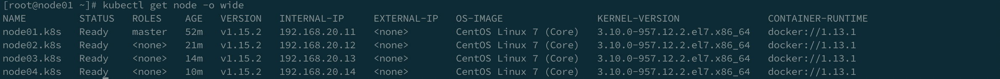

# Kubernetes On Premise
In this document, I am going to talk about how to install kubernetes on premise, this is a way my team at VNG use to deployment our system. But It will have a litte diffence, such at in this document it just one master node!
# Prerequsite
* `vagrant` is installed: https://www.vagrantup.com/
* `vagrant-disksize` plugin: vagrant plugin install vagrant-disksize

# Server configuration
| Hostname | Role | IP | OS
|-----|:-----:|:-----:|:-----|
|node-1|master|192.168.20.11|Centos/7|
|node-2|worker|192.168.20.12|Centos/7|
|node-3|worker|192.168.20.13|Centos/7|
|node-4|worker|192.168.20.14|Centos/7|
# Master
* Disable swap:
```shell
sudo swapoff -a
sudo sed -i '/ swap / s/^\(.*\)$/#\1/g' /etc/fstab
```

* Enable iptables bridge
```shell
cat <<EOF >  /etc/sysctl.d/k8s.conf
net.bridge.bridge-nf-call-ip6tables = 1
net.bridge.bridge-nf-call-iptables = 1
EOF

# Load system config from all configuration files
sysctl --system

# enable br_netfilter
modprobe br_netfilter
# You also should check netfilter is installed by
# "lsmod | grep br_netfilter"
```

* TurnOff SE Linux
```shell
sudo setenforce 0
sudo sed -i 's/^SELINUX=enforcing$/SELINUX=permissive/' /etc/selinux/config
```

* Add kubernetes repository, install kubelet and docker
```shell
cat <<EOF > /etc/yum.repos.d/kubernetes.repo
[kubernetes]
name=Kubernetes
baseurl=https://packages.cloud.google.com/yum/repos/kubernetes-el7-x86_64
enabled=1
gpgcheck=1
repo_gpgcheck=1
gpgkey=https://packages.cloud.google.com/yum/doc/yum-key.gpg https://packages.cloud.google.com/yum/doc/rpm-package-key.gpg
EOF

yum install -y kubelet kubeadm kubectl docker

systemctl enable kubelet
systemctl enable docker
systemctl start docker
```

* Config kubelet
node-ip argument is node ip, if people use my Vagrantfile, master node ip is 192.168.20.11
```shell
sudo vi /etc/sysconfig/kubelet

KUBELET_EXTRA_ARGS=--runtime-cgroups=/systemd/system.slice --kubelet-cgroups=/systemd/system.slice --node-ip=192.168.20.11
```

* Install cluster
```shell
sudo kubeadm init --apiserver-advertise-address 192.168.20.11 --pod-network-cidr 10.3.0.0/16
```

* Install network plugin
```shell
kubectl apply -f https://raw.githubusercontent.com/cloudnativelabs/kube-router/master/daemonset/kubeadm-kuberouter.yaml
```

* Taint master node
```shell
kubectl taint nodes --all node-role.kubernetes.io/master-
```

* Print join token
```shell
kubeadm token create --print-join-command
```

* Note: reboot each server after install succession, It just make sure that our system will work well at the next time but whatever work well today not sure fully work tomorrow!
# Worker Node 
The same at master to step config kubelet. Instead of kubeadm init, on worker we need:
```shell
kubeadm join 192.168.20.11:6443 --token t3cmy4.1jril4an8xhsdqi1     --discovery-token-ca-cert-hash sha256:e3feb6e18991d1eef2631450887c9b8e948f25663a5c57fa5b9e66e3c488a4ad
```
We will get 
Note: If above command pause a long time at "Running pre-flight checks" you shoud ^C, reboot server and try again.

# This is result 

